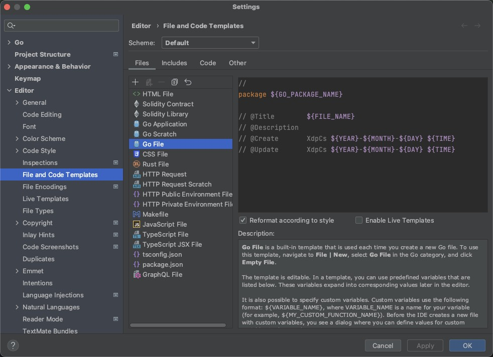
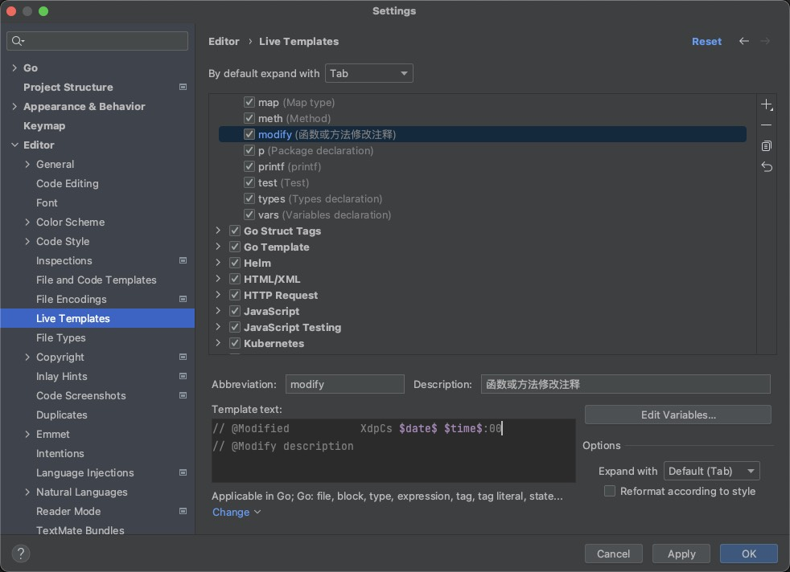
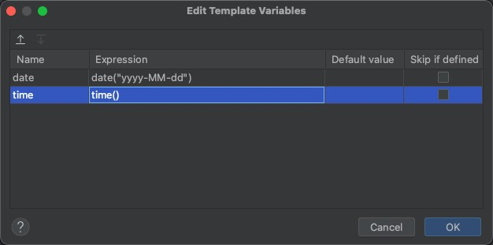
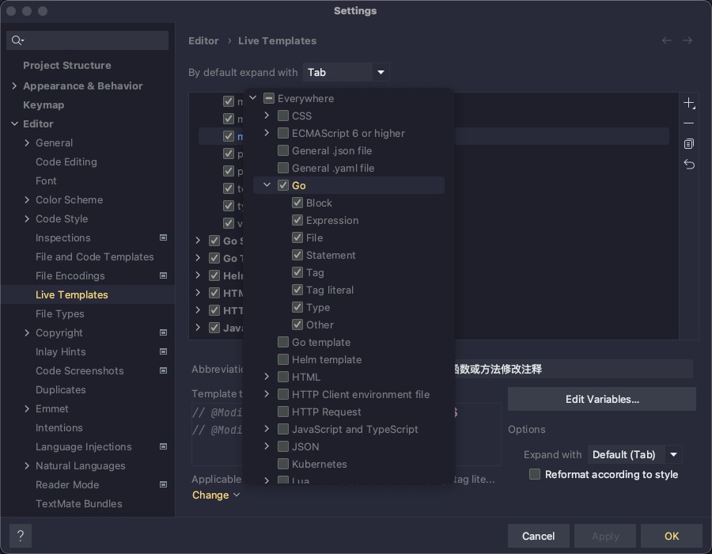

# Go-Code-Comment-Standard


## 背景

* 当新接手他人的项目，我们很容易不知所措，不知道这个函数的作用是什么，即使有很好的命名规范，这种事情也会时常发生，甚至有时候几个月不碰这个项目，自己再看这个函数，也会有一种云里雾里的感觉
* 如果拥有好的注释，方便我们自己以后维护，也方便后来的同事接手你的项目，不至于对你的代码说这写的是啥，像一坨💩

## 注释规范

* 注释看团队，我们团队习惯使用英文，所以都使用英文，只要整个团队统一一个注释语言即可
* 全部使用单行注释,`//`后需要使用一个空格

## 包注释

* 包注释是对包的介绍
* 每个包都应有至少有一个包注释，在同一个包下，任一一个源文件中注释即可
* 放置在`package`之前，来简短描述这个包的功能

```go
// 包的功能介绍
package 包名称
```

### 文件注释

* 每个文件都应有一个文件注释
* 放置在`package`之后，需要包含文件名称，文件描述，文件作者及其时间，更新作者及其时间
* 因为在公司正常开发流程中，可能合并分支的时候，只有自己部门的业务主管，有这个权限进行合并代码，如果去看git的日志，如果只看主分支，只会显示主管的id，很难很快落实到每个人上

```go
package 包名称

// @Title        文件名称
// @Description  文件描述
// @Create       创建作者 日期 时间
// @Update       更新作者 日期 时间
```

### 结构体注释和接口注释

* 每个结构体或接口都应有注释
* 在结构体或接口定义上面，需要有一个对整个结构体或接口的简要介绍
* 结构体或接口内的每个成员变量也需要有注释

```go
// User defines user login info
type User struct {
    UserName string // user's name
    Password string // user's password
}

// IUser defines user function
type IUser interface {
    Login()  // user login into the system
    Logout() // user logout the system
}
```

### 函数和方法的注释

* 每个函数或方法都应有注释
* 需要包含函数或方法名称、函数或方法描述、函数或方法的创建作者及其创建时间、输入参数及其参数类型和解释、返回参数及其参数类型和解释
* 在函数或方法定义上面，书写下面的注释


```go
// 函数或方法名称
// @Description        函数或方法描述
// @Create             作者 日期 时间
// @Param              输入参数名 参数类型 说明
// @Return             返回参数名 参数类型 说明
```

* 如果涉及到函数或方法的变更，需要写明修改作者、修改日期和时间、修改的功能描述

```go
// @Modified           作者 日期 时间
// @Modify description 修改的功能描述
```

### 代码逻辑注释

* 每个代码块都需要添加注释

```go
// This is my wife's birthday
if birthday == 1118 {
    ...
}
```

## 配置

* 本配置均采用`Goland` IDE

### 包注释和文件注释配置

#### Mac 使用

* Goland->Settings->Editor->File and Code Templates->Go File
* 复制下面的模版，替换原先的模版

```shell
// 
package ${GO_PACKAGE_NAME}

// @Title        ${FILE_NAME}
// @Description  
// @Create       XdpCs ${YEAR}-${MONTH}-${DAY} ${TIME}
// @Update       XdpCs ${YEAR}-${MONTH}-${DAY} ${TIME}
```



### 修改快捷方式配置

#### Mac 使用

* Goland->Settings->Editor->Live Templates
* 复制下面的模版，替换原先的模版
```go
// @Modified           XdpCs $date$ $time$:00
// @Modify description 
```


* 点击Edit Variables...
* 配置如下图所示



* 配置完成后，点击Define，勾选Go



* 使用只需要使用modify+回车即可

### 结构体注释、接口注释、函数注释、方法注释

#### 安装插件

* [Goanno插件](https://github.com/loveinsky100/goanno)
* 同时也可以使用`Goland`的`Marketplace`搜索进行安装
* 配置插件注释格式，使用Tools-> Goanno Settings

#### 函数注释、方法注释

* Normal Method 配置、Interface Method 配置

```shell
// ${function_name}
// @Description ${todo}
// @Create         XdpCs ${date} 
// @Param          ${param_name} ${param_type}
// @Return          ${ret_name_type}
```

#### 结构体注释

* Struct 配置

```shell
// ${struct_name} 
```

#### 接口注释

* Interface 配置

```shell
// ${interface_name}
```

#### 测试

* 使用`control + command + /`进行测试

## 示例

[示例](demo/main.go)

## License

Go-Code-Comment-Standard is under the [MIT](LICENSE). Please refer to LICENSE for more information.
